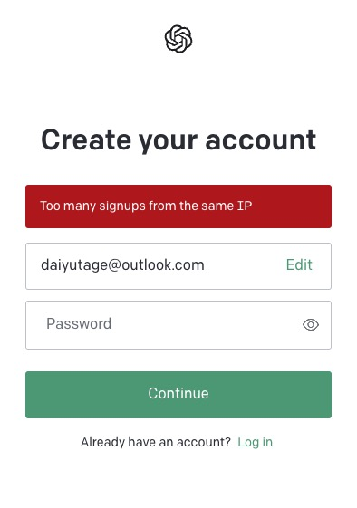
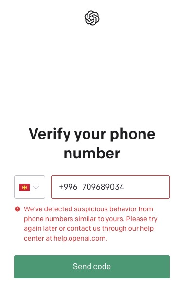

# IP被限制

由于国内很多人都用的是梯子上网去注册，导致多人共享一个ip访问ChatGPT的官方，该ip也就被风控检测到了。在注册的时候提示如下

原因就是很多人用这个IP来注册。这个时候只能更换梯子节点了，注意在更换的时候不要选择一些冷门的地区，比如新加坡之类的，不要一上来就选美国，日本这些地方，选这些地方的人很多大概率会导致ip被共享的概率大。

# 虚拟手机号被风控

国内很多人都用的虚拟手机号平台https://sms-activate.org/在获取一个验证码，但是现在在注册时候该平台上的有些手机号也被ChatGPT限制了，我第一次用了一个德国的号进行注册的时候就提示注册不了，如下图：

出现这个问题是这个手机号被很多人用来注册过导致风控了。所以换一个别的地区的手机号再重试就好了。我最后用了一个秘鲁的手机号成功了，害的我浪费了2美元。我第一个号注册时候就选择的是德国，那个时候是没有问题的。现在限制很严格了。

