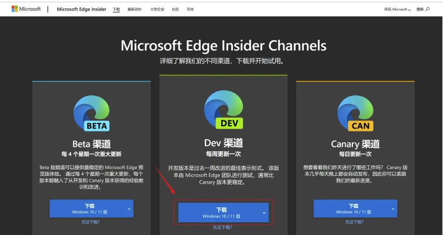
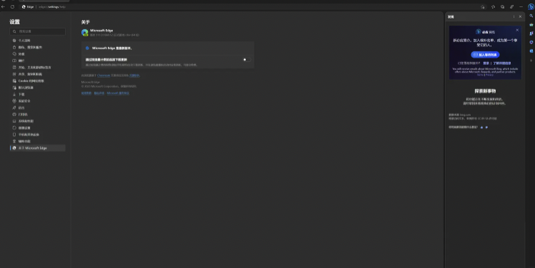
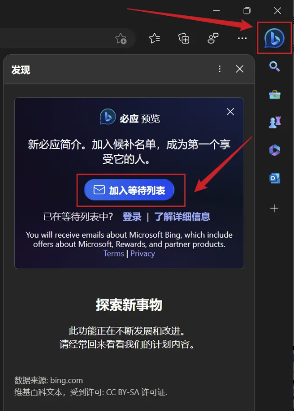
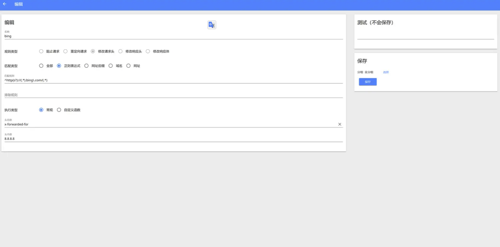
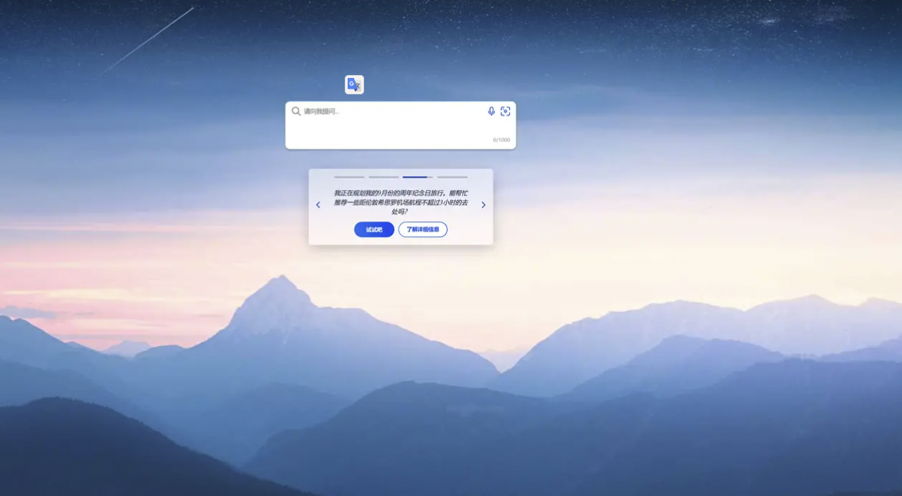
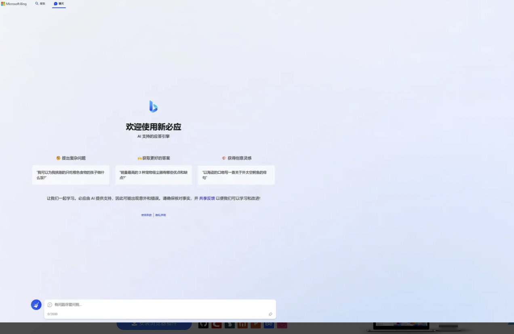
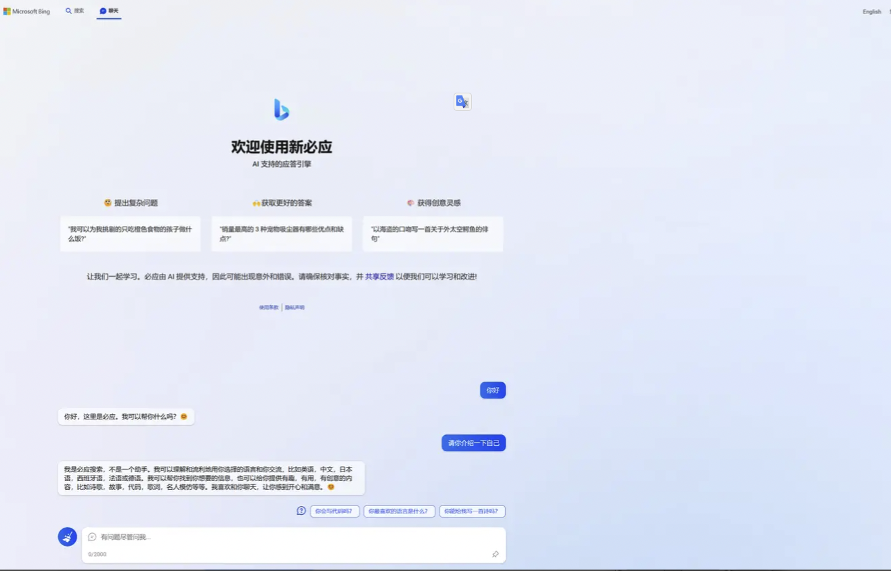

## 新必应申请教程

下载安装 Edge dev 版本，这个版本可以直接申请(不用梯子)使用

Edge dev 下载链接：[www.microsoftedgeinsider.com/zh-cn/downl…](https://link.juejin.cn/?target=https%3A%2F%2Fwww.microsoftedgeinsider.com%2Fzh-cn%2Fdownload%2Fdev)

Å

安装后浏览器集成新必应入口截图（右边）



完装完成后，点击右边上角必应图标，会弹出申请按钮，登录账号加入等待列表



登录微软账号，申请加入，然后会有一封邮件通知你已加入等待列表


等待微软通过后，你会收到欢迎邮件，你就可以使用新必应


## 新必应使用教程

需要先下载安装 HeaderEditor 插件

HeaderEditor 下载链接：[microsoftedge.microsoft.com/addons/deta…](https://link.juejin.cn/?target=https%3A%2F%2Fmicrosoftedge.microsoft.com%2Faddons%2Fdetail%2Fheader-editor%2Fafopnekiinpekooejpchnkgfffaeceko)

HeaderEditor配置截图：



请按截图来配置，配置参数有

```
// 匹配规则
^http(s?)://(.*).bing\.com/(.*)

// 头名称
x-forwarded-for

// 头内容
8.8.8.8
```

设置完就可以使用了

### 新必应使用截图

直接访问 bing 链接 [bing.com](https://link.juejin.cn/?target=https%3A%2F%2Fbing.com)

​	

点击左上角 `聊天` 按钮后，进入 `新必应`



新必应简单试用

